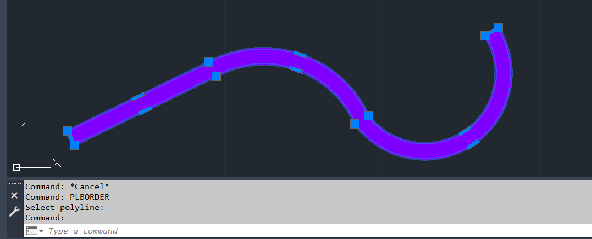

# PLBORDER

Creates a zero-width boundary polyline around a constant-width polyline.

## Features

- Creates a boundary from any constant-width **LWPOLYLINE**
- Preserves the original polyline
- Places the new boundary on the same layer
- Sets the resulting polyline width to **0**
- Pure AutoCAD .NET 8 implementation (no LISP or COM)

## Command

```text
PLBORDER
```

## Preview

| Before | After |
|--------|-------|
|  |  |

## How it Works

1. Select a constant-width polyline.
2. The command creates inward and outward offset curves using half the polyline width.
3. The offset curves are connected at both ends.
4. The entities are joined into a single closed polyline.
5. Temporary entities are removed, leaving the final zero-width boundary.

## Requirements

- AutoCAD / Civil 3D 2025+
- .NET 8
- Input must be an **LWPOLYLINE** with a **constant width greater than zero**.

## Installation

1. Build the project.
2. Load the generated DLL using:

```text
NETLOAD
```

3. Run:

```text
PLBORDER
```

## Author

**Suman Kumar**

GitHub: https://github.com/BHUTUU

## License

MIT License